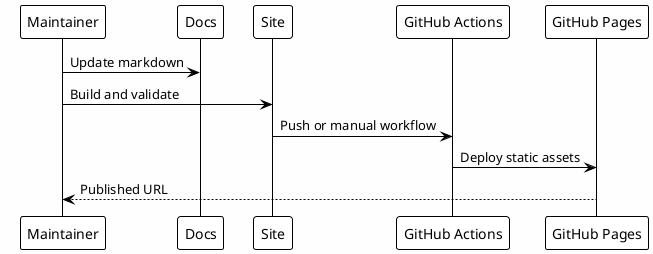

# 16 - GitHub Pages Maintenance

This note is for maintainers, not for the onboarding journey.

GitHub Pages is the distribution layer for the interactive playbook. Learners do not need to create a repository, configure Pages or publish anything.

## Maintainer Responsibilities

- keep `docs/` sanitized;
- run `scripts/validate-docs.py`;
- run `scripts/sanitize-docs.py`;
- run the site build;
- publish with GitHub Actions when the repository is public or the plan supports private Pages.

## Flow

