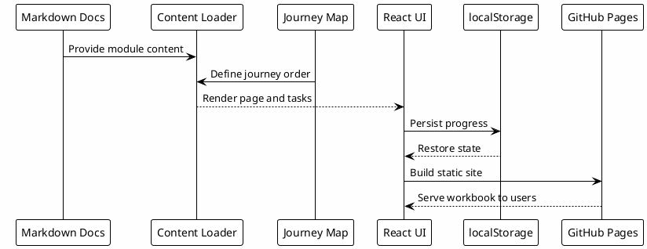

# 16 - Playbook no GitHub Pages

## Em uma frase

O GitHub Pages entrega este playbook como uma experiência guiada, usando os documentos Markdown como fonte de conteúdo.

## O que você vai entender

Ao final desta página, você deve entender por que o playbook aparece como site, onde o conteúdo nasce e por que o progresso fica salvo apenas no navegador.

## Resumo

O site interativo é a interface de leitura do playbook.

Quem está aprendendo não precisa criar repositório, configurar GitHub Pages ou publicar nada. A pessoa só precisa seguir a jornada, entender cada camada, responder os checkpoints e avançar para a próxima etapa.

Publicação, build e manutenção do site são responsabilidades de quem mantém o playbook.

## Diagrama



## Papel do GitHub Pages

GitHub Pages entra como camada de distribuição.

Ele permite que o material seja acessado pelo navegador, com navegação, progresso local e checkpoints. Ele não muda o conteúdo de origem: os documentos Markdown continuam sendo a fonte principal.

## Estrutura alvo

```text
<repo-name>/
  README.md
  docs/
    01-purpose.md
    02-ecosystem-layers.md
    ...
    16-github-pages-workbook.md
  site/
    src/
    package.json
  scripts/
    sanitize-docs
    validate-docs
```

## Modelo interativo

Componentes esperados:

- sidebar com etapas;
- leitor Markdown;
- checklist por módulo;
- botão de próxima página;
- status por etapa;
- progresso salvo em `localStorage`;
- página de troubleshooting.

## O que o usuário final vê

O usuário final não precisa saber como o site foi implementado. Ele precisa ver:

- onde está na jornada;
- qual conceito está aprendendo;
- qual arquivo ou template deve usar;
- qual pergunta valida entendimento;
- quando a próxima etapa está liberada.

## Conteúdo como fonte

Os documentos Markdown devem ser a fonte de conteúdo da página.

O site interpreta frontmatter:

```yaml
order: 1
module: purpose
status: draft
```

E renderiza:

- título;
- resumo;
- passos;
- checkpoints;
- próximo módulo.

## Stack recomendada

Para mantenedores, a stack recomendada é:

- Vite + React para a interface interativa;
- Markdown em `docs/` como fonte de conteúdo;
- `localStorage` para progresso individual no navegador;
- GitHub Pages como distribuição estática.

## Checkpoint

Valide o entendimento:

- o site é uma camada de apresentação;
- os documentos Markdown são a fonte;
- o progresso fica no navegador;
- publicação e manutenção do site são responsabilidade dos mantenedores;
- quem está fazendo o onboarding usa o site para seguir a jornada, não para publicar o playbook.

## Erros comuns

- Confundir o site com a fonte primária.
- Esquecer que o progresso fica no navegador do usuário.
- Esperar que o progresso seja compartilhado entre pessoas.
- Colocar conteúdo apenas na UI e esquecer de atualizar os Markdown.

## Fim do Workbook

Ao final, o usuário deve conseguir configurar e entender o ecossistema de ponta a ponta.
