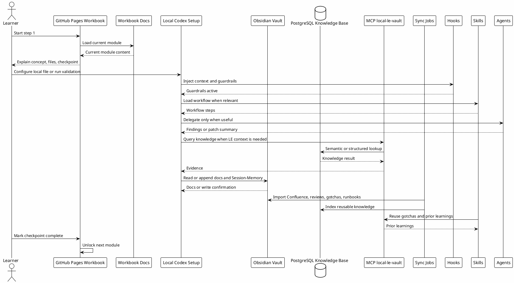
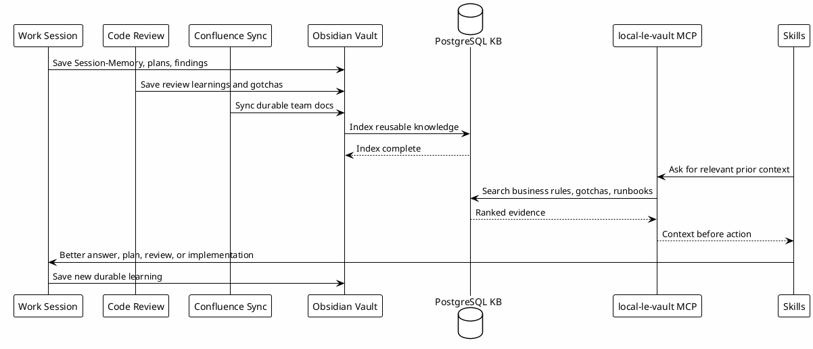

# Codex Workflow Workbook - Implementation Plan

## Status Atual

Atualizado em 2026-05-29:

| Fase | Status | Evidencia |
|---|---|---|
| Fase 0 - Preparacao | Concluida para MVP | Inventario inicial de `~/.codex`, overview, workshop antigo e `workbook/` confirmado. |
| Fase 1 - Investigacao por Modulo | Concluida para MVP | Configuracoes reais e materiais anteriores foram usados para gerar docs de terminal, config, rules, agents, hooks, MCPs, skills, vault e knowledge loop. |
| Fase 2 - Documentacao Modular | Concluida para MVP | `docs/` contem 21 paginas guiadas mais documentos auxiliares de plano, UX e handoff. |
| Fase 3 - Repositorio de Trabalho | Concluida localmente | Repo privado criado e clonado em um checkout local de trabalho; arquivos ainda sem commit. |
| Fase 4 - Modelo Interativo | Implementada | Vite + React com jornadas, capitulos, paginas, checkpoints, perguntas, progresso local, PlantUML, copy buttons e templates de download. |
| Fase 5 - GitHub Pages | Parcial | Build local passa e base path esta configurado; workflow/publicacao GitHub Pages ainda pendente. |
| Fase 6 - Validacao e Iteracao | Em andamento | E2E/manual com Playwright validou paginas principais, responsividade, sticky task panel, downloads e console; teste completo com usuario novo ainda pendente. |

Status operacional:

- URL local ativa: `http://127.0.0.1:5174/codex-workflow-workbook/`.
- Servidor antigo em `5173` pode existir, mas `5174` foi reaberto para refletir o bundle mais recente.
- Ultimo build validado: `npm run build` em `site/`.
- Nao houve commit nem push dos arquivos locais.
- Handoff atual: `Current-Handoff.md`.

## Objetivo

Criar uma documentacao modular e uma pagina interativa para ensinar como configurar e operar o ecossistema local do Codex usado no workflow de trabalho.

O material deve explicar:

- o que cada camada faz;
- por que cada item existe;
- como os itens se relacionam;
- como trabalho real vira conhecimento reutilizavel;
- como configurar o ambiente passo a passo;
- quais checkpoints provam que a configuracao esta funcionando;
- onde comeca e onde termina cada fluxo de trabalho.

O ponto de partida foi o documento `Codex-Workflow-Overview.md`, mas ele deve ser tratado como fonte inicial, nao como verdade final. A investigacao precisa comparar o overview com os arquivos reais em `~/.codex`, com o vault Obsidian e com o funcionamento atual do MCP local baseado em PostgreSQL.

## Principios

1. Documentar por tipo de configuracao, nao por historico da implementacao.
2. Explicar primeiro o papel da camada, depois o arquivo, depois o checkpoint.
3. Separar material de aprendizagem de material operacional.
4. Evitar expor segredos, tokens, credenciais, paths sensiveis ou detalhes privados desnecessarios.
5. Manter o site como guia interativo progressivo, nao como dump do vault.
6. Usar o vault como fonte base, mas preparar o conteudo para publicar em um repositorio separado no GitHub Pages.
7. Tratar conhecimento reutilizavel como produto do workflow: code reviews, Confluence, Session-Memory, gotchas, runbooks e sincronizacoes devem voltar para a base e reaparecer nas skills quando forem relevantes.

## Escopo Principal

### Documentos do workbook

Criar um documento de analise e explicacao para cada modulo:

| Documento | Tema | Pergunta que responde |
|---|---|---|
| `00-terminal-and-codex-cli.md` | Terminal e Codex CLI | Como preparar terminal, Node, ferramentas basicas e Codex CLI antes das configuracoes? |
| `00-environment-prerequisites.md` | Requisitos minimos | O que precisa existir antes de iniciar e o que sera configurado depois? |
| `01-purpose.md` | Purpose | Para que esse ecossistema existe e qual problema resolve? |
| `02-ecosystem-layers.md` | Ecosystem Layers | Quais camadas existem e como elas se conectam? |
| `03-main-sequence.md` | Main Sequence | Qual e o fluxo inicio-fim de uma interacao normal? |
| `04-workflow-boundaries.md` | Workflow Boundaries | Quando cada fluxo comeca, quando termina e quais guardrails se aplicam? |
| `05-config-toml.md` | `~/.codex/config.toml` | Como a configuracao principal governa modelo, MCP, hooks, permissoes e comportamento? |
| `05-rules-and-instructions.md` | Rules e instructions | Como compartilhar regras globais e de projeto com placeholders por usuario? |
| `06-copilot-config.md` | `~/.codex/copilot.config.toml` | Como o copilot local se diferencia da configuracao global? |
| `07-agents.md` | Agents | Como `copilot`, `researcher`, `reviewer` e `implementer` sao usados e quando nao usar? |
| `08-hooks.md` | Hooks | Como guardrails, contexto automatico, tracking e autosave entram no fluxo? |
| `09-mcp-and-connectors-setup.md` | MCPs e connectors | Como instalar/habilitar `chrome-devtools`, `context7`, GitHub, Slack, Atlassian, Datadog, Probe e local vault sem expor segredos? |
| `09-skills.md` | Skills | Como skills funcionam como workflows reutilizaveis e quais ficam no caminho diario? |
| `09-local-configuration-hands-on.md` | Hands-on local | Como testar se rules, agents, hooks, MCPs e skills refletiram no workflow local? |
| `10-token-economy.md` | Token Economy | Como `rtk`, leituras limitadas, MCPs e memoria reduzem desperdicio? |
| `11-vault-and-memory.md` | Obsidian e Session-Memory | Como o vault vira base operacional e continuidade de trabalho? |
| `12-local-knowledge-base.md` | PostgreSQL e local-le-vault | Como o MCP usa PostgreSQL para busca de conhecimento e por que isso funciona? |
| `13-knowledge-reuse-loop.md` | Ciclo de conhecimento reutilizavel | Como informacoes de banco, Confluence, codereviews, gotchas e sincronizacoes viram contexto usado por skills depois? |
| `14-automation-sync.md` | Automacoes e sincronizacao | Como automacoes mantem dados, docs, memoria e conhecimento alinhados? |
| `15-checkpoints.md` | Checkpoints | Como validar cada parte do ambiente apos configurar? |
| `16-github-pages-workbook.md` | Site interativo | Como transformar os docs em uma experiencia navegavel e progressiva? |
| `Current-Handoff.md` | Handoff atual | Qual e o estado atual, o que foi implementado, como validar e o que falta? |

### Fora do escopo principal

As skills `daily`, `codereview`, `commit`, `create-pr`, `deslop`, `feature-dev` e `investigation` nao devem virar capitulos centrais nesta primeira versao.

Elas podem aparecer apenas como exemplos ou referencias quando explicarem:

- como uma skill e descoberta;
- como uma skill ativa um workflow;
- como um fluxo reutilizavel se encaixa na camada `Skills`.

O foco do workbook e configurar e entender o ecossistema, nao ensinar cada workflow especifico de entrega.

## Fontes de Investigacao

### Fontes locais primarias

| Fonte | Uso |
|---|---|
| `Luxury-Escapes/Projects/codex-workflow/Codex-Workflow-Overview.md` | Fonte inicial para Purpose, Ecosystem Layers, Token Economy, Main Sequence e Boundaries. |
| `~/.codex/config.toml` | Fonte real da configuracao principal. |
| `~/.codex/copilot.config.toml` | Fonte real da configuracao do copilot. |
| `~/.codex/agents/*.toml` | Fonte real dos agentes locais. |
| `~/.codex/hooks/*` | Fonte real de hooks, wrappers, guardrails e automacoes auxiliares. |
| `~/.codex/skills/*/SKILL.md` | Fonte real do formato e uso de skills. |
| `~/.codex/RTK.md` | Fonte do contrato de uso de `rtk`. |
| `Luxury-Escapes/Knowledge-Base/Session-Memory/` | Fonte de continuidade e exemplos reais de handoff. |
| `local-le-vault` e wrappers MCP | Fonte de funcionamento do vault RAG e PostgreSQL. |

### Fontes secundarias

| Fonte | Uso |
|---|---|
| `~/.codex/agent-memory/` | Preferencias, gotchas e contexto duravel do agente. |
| `Luxury-Escapes/Knowledge-Base/` | Business rules, runbooks e docs de suporte. |
| Repositorio GitHub Pages futuro | Destino de publicacao e estrutura da pagina interativa. |

## Arquitetura Alvo

## Knowledge Reuse Loop

O workbook precisa explicar que o ecossistema nao e apenas um conjunto de configuracoes locais. Ele e um ciclo de aprendizagem operacional.

Fluxo esperado:

1. Trabalho real gera evidencias: investigacoes, code reviews, debugging, dailies tecnicas, Confluence, runbooks, decisions, gotchas e Session-Memory.
2. As informacoes relevantes sao salvas no vault ou sincronizadas por automacoes.
3. O conteudo reutilizavel e indexado no PostgreSQL usado pelo `local-le-vault`.
4. As skills consultam essa base antes de responder, revisar ou implementar.
5. O resultado de uma nova sessao pode gerar novos gotchas, review learnings ou memoria.
6. O ciclo se repete, reduzindo redescoberta e melhorando a qualidade das proximas execucoes.

Esse ciclo deve aparecer como um modulo proprio porque ele explica por que o workflow funciona com mais contexto ao longo do tempo. Sem essa parte, `skills`, `hooks`, `MCP`, `Session-Memory` e `PostgreSQL` parecem pecas isoladas.

## Fases de Implementacao

### Fase 0 - Preparacao

Objetivo: garantir que o trabalho comece com fontes certas e sem publicar informacao sensivel.

Tarefas:

- Confirmar o inventario real de arquivos em `~/.codex`.
- Confirmar que `workbook/` sera o staging area dos docs.
- Definir o nome final do repositorio GitHub Pages.
- Definir se o site sera publico ou privado com Pages publico.
- Definir criterios de redacao para remover segredos e paths sensiveis.

Checkpoint:

- Existe um inventario inicial de fontes.
- Existe lista de redacoes obrigatorias antes de publicar.
- Ivan aprovou o nome/repositorio alvo antes de qualquer criacao externa.

### Fase 1 - Investigacao por Modulo

Objetivo: analisar caso a caso cada tipo de configuracao.

Tarefas:

- Ler o documento base `Codex-Workflow-Overview.md`.
- Comparar overview com arquivos reais.
- Para cada modulo, registrar:
  - o que e;
  - por que existe;
  - quais arquivos controla;
  - como entra no fluxo;
  - quais informacoes produz ou reutiliza;
  - dependencias;
  - riscos;
  - checkpoint de validacao.
- Identificar divergencias entre overview e estado atual.
- Separar fatos confirmados de inferencias.
- Mapear o ciclo de conhecimento: origem, persistencia, indexacao, recuperacao e reuso pelas skills.

Checkpoint:

- Cada modulo tem notas de evidencia.
- O overview foi marcado como atualizado, parcial ou desatualizado por secao.
- Nenhuma conclusao depende apenas de memoria ou suposicao.

### Fase 2 - Documentacao Modular

Objetivo: transformar a investigacao em documentos independentes, ensinaveis e publicaveis.

Tarefas:

- Criar os documentos `01` a `16` no `workbook/`.
- Ajustar a numeracao final se o modulo de conhecimento reutilizavel exigir documentos auxiliares.
- Usar formato consistente:
  - resumo;
  - papel no ecossistema;
  - arquivos envolvidos;
  - fluxo de funcionamento;
  - por que funciona;
  - conhecimento produzido;
  - conhecimento consumido;
  - passos de configuracao;
  - checkpoints;
  - erros comuns;
  - links para proximo modulo.
- Adicionar diagramas PlantUML onde o relacionamento entre camadas ficar mais claro.
- Manter exemplos sanitizados.

Checkpoint:

- Todos os documentos abrem bem no Obsidian.
- Wikilinks locais funcionam.
- Cada documento tem pelo menos um checkpoint pratico.
- Nenhum documento depende de contexto da conversa.

### Fase 3 - Repositorio de Trabalho

Objetivo: criar o repositorio real no GitHub pessoal e usar esse checkout como fonte de desenvolvimento da documentacao e da pagina.

Tarefas:

- Definir o nome do repositorio no GitHub pessoal de Ivan.
- Criar o repositorio no GitHub apenas depois de aprovacao explicita, porque isso e um efeito externo.
- Clonar o repositorio em um diretório local de trabalho.
- Criar a estrutura inicial do projeto dentro do novo repo:
  - `docs/` para os documentos Markdown publicaveis;
  - `site/` ou raiz do app para a pagina interativa;
  - `content/` se a stack escolhida separar conteudo de componentes;
  - `scripts/` para validacao, sanitizacao e export dos documentos;
  - `README.md` com objetivo, setup local e fluxo de contribuicao.
- Copiar ou gerar os documentos modulares a partir do `workbook/` para dentro do repo.
- Definir se o `workbook/` do vault continua sendo staging ou se o repo passa a ser a fonte canonica.
- Garantir que qualquer conteudo copiado do vault seja sanitizado antes de entrar no repo publico.

Checkpoint:

- Repositorio existe no GitHub pessoal de Ivan.
- Checkout local existe em um diretório de trabalho escolhido pela pessoa mantenedora.
- Estrutura inicial esta criada.
- Documentos base estao no repo e podem ser usados pela pagina.
- Nenhum segredo, token, log privado ou detalhe sensivel foi copiado para o repo.

### Fase 4 - Modelo Interativo

Objetivo: desenhar como a pessoa navega pelo workbook no site.

Tarefas:

- Definir uma sequencia linear de aprendizado.
- Definir estado de progresso local no navegador.
- Definir a hierarquia `Journey -> Chapter -> Page -> Checkpoint / Question`.
- Definir uma rota por jornada.
- Definir capitulos dentro de cada jornada.
- Definir paginas pequenas dentro de cada capitulo.
- Definir perguntas de revisao de entendimento por pagina ou por capitulo.
- Bloquear a proxima pagina, capitulo ou jornada ate o usuario responder corretamente quando a pergunta for obrigatoria.
- Mapear os documentos atuais para jornadas e capitulos:
  - Foundations: `01` a `04`;
  - Local Configuration: `00-terminal`, `00-environment`, `05` a `09` e hands-on;
  - Knowledge System: `10` a `14`;
  - Build and Publish: `15`, `16`, UX reference e journey model.
- Definir componentes:
  - sidebar de etapas;
  - conteudo renderizado em Markdown;
  - pagina de jornada;
  - navegacao por capitulos;
  - navegacao por paginas;
  - checklist por pagina;
  - perguntas de entendimento;
  - bloco de comandos;
  - estado `not started`, `in progress`, `done`;
  - botao `Next step`;
  - indice de troubleshooting.
- Definir como os docs Markdown viram paginas.
- Incorporar os aprendizados da referencia `UX-Reference-Codex-Training-Room.md`:
  - progresso global;
  - task cards por pagina;
  - checkpoints marcaveis;
  - revisao de entendimento antes de avancar;
  - tracks/filtros;
  - persistencia em `localStorage`;
  - leaderboard apenas como fase futura para workshops.

Checkpoint:

- Existe um mapa de rotas do site.
- Existe um contrato de frontmatter para cada doc.
- Existe um contrato para `journeys`, `chapters`, `pages`, `checkpoints` e `questions`.
- Existe wireframe textual suficiente para implementar sem redesenhar do zero.

### Fase 5 - GitHub Pages

Objetivo: criar o projeto publicavel em GitHub Pages sem acoplar diretamente ao vault privado.

Tarefas:

- Stack escolhida: Vite + React + Markdown loader.
- Usar o repositorio pessoal criado na Fase 3 como fonte da pagina.
- Configurar o app para interpretar os documentos Markdown como conteudo navegavel.
- Configurar GitHub Pages.
- Criar pipeline simples de build.

Checkpoint:

- Site roda localmente.
- Build passa localmente.
- GitHub Pages renderiza a primeira versao.
- Conteudo publicado nao contem segredos, tokens, logs privados ou paths sensiveis desnecessarios.

### Fase 6 - Validacao e Iteracao

Objetivo: testar se outra pessoa consegue seguir o guia.

Tarefas:

- Rodar o guia como usuario novo.
- Marcar pontos confusos.
- Validar comandos de checkpoint.
- Separar checkpoints que exigem ambiente LE daqueles que podem ser genericos.
- Criar uma pagina de troubleshooting.

Checkpoint:

- O fluxo completo pode ser seguido do zero ate um ambiente funcional.
- Cada bloqueio conhecido tem diagnostico e proximo passo.
- O site explica inicio, fim e limites do workflow.

## Sequencia Recomendada de Execucao

1. Atualizar inventario do estado atual.
2. Fazer investigacao de `config.toml` e `copilot.config.toml`.
3. Fazer investigacao de `agents`.
4. Fazer investigacao de `hooks`.
5. Fazer investigacao de `skills`, com foco no mecanismo e nao no detalhe de cada workflow.
6. Fazer investigacao de `rtk` e Token Economy.
7. Fazer investigacao de Obsidian, Session-Memory, agent-memory e sincronizacao.
8. Fazer investigacao de `local-le-vault`, PostgreSQL e MCP wrappers.
9. Mapear o ciclo de conhecimento reutilizavel: banco, sincronizacoes, Confluence, codereviews, gotchas, runbooks e reuso pelas skills.
10. Reconciliar tudo com `Codex-Workflow-Overview.md`.
11. Escrever documentos modulares.
12. Criar o repositorio pessoal no GitHub depois de aprovacao explicita.
13. Clonar o repo em um diretório local de trabalho.
14. Criar os arquivos base da documentacao dentro do repo.
15. Desenhar contrato do site interativo usando esses documentos como fonte.
16. Configurar GitHub Pages.

## Riscos

| Risco | Impacto | Mitigacao |
|---|---|---|
| Publicar informacao privada do ambiente local | Alto | Sanitizar paths, tokens, credenciais, nomes internos sensiveis e exemplos de logs antes do repo publico. |
| Documentacao virar dump tecnico | Medio | Manter cada modulo com explicacao, razao, configuracao e checkpoint. |
| Overview estar desatualizado | Medio | Tratar overview como fonte inicial e validar contra arquivos reais. |
| Site acoplar demais ao vault | Medio | Usar export sanitizado para GitHub Pages. |
| Checkpoints dependerem de acessos LE privados | Medio | Separar checkpoints genericos de checkpoints internos. |
| Explicar skills demais | Baixo | Manter foco no mecanismo de skills e citar workflows excluidos apenas como exemplos. |
| Nao explicar o ciclo de conhecimento | Alto | Criar modulo proprio mostrando como informacoes salvas e sincronizadas viram gotchas, review learnings e contexto reutilizado pelas skills. |

## Decisoes Pendentes

- Publicar ou manter privado ate revisao final de sanitizacao.
- Criar workflow de GitHub Pages e decidir branch/source de publicacao.
- Decidir se o vault `workbook/` continua staging espelhado ou se o repo vira fonte canonica.
- Manter e expandir scripts `validate-docs` e `sanitize-docs` conforme novos tipos de conteúdo entrarem.
- Decidir se o progresso do usuario no site fica somente em `localStorage` ou tambem pode ser exportado como checklist.
- Fazer commit/push inicial quando Ivan pedir.

## Definition of Done

- [x] `workbook/` e `docs/` contem a documentacao modular do MVP.
- [x] Repositorio pessoal foi criado e clonado em um checkout local de trabalho.
- [x] Documentos publicaveis existem dentro do repositorio e servem como base da pagina.
- [x] Cada modulo guiado possui explicacao, relacoes, passos ou checkpoint de entendimento/configuracao.
- [x] O ciclo de conhecimento reutilizavel esta documentado de ponta a ponta.
- [x] A pagina interativa permite navegar por jornadas, capitulos e paginas com bloqueio progressivo.
- [x] Build local passa.
- [ ] GitHub Pages publicado.
- [ ] Conteudo revisado manualmente para publicacao publica.
- [ ] Scripts de validacao/sanitizacao criados.
- [ ] Fluxo completo testado por uma pessoa nova.
