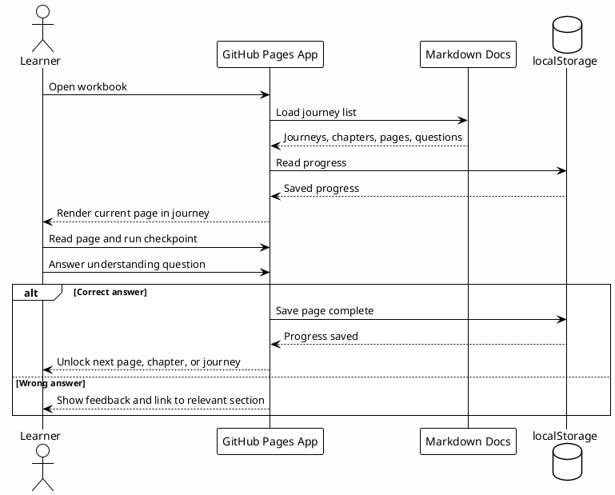

# UX Reference - Codex Training Room

## Contexto

Referencia observada: `https://www.codex-training.com/rooms/Kyoto-9726`.

Objetivo da observacao: entender o padrao de experiencia para uma pagina interativa de treinamento, com sala, progresso, tarefas e leaderboard.

## Padroes Observados

### Entrada na sala

- URL contem o identificador da sala.
- Usuario entra por uma tela simples de join.
- Nickname e randomizado.
- Idioma pode ser escolhido antes ou depois de entrar.
- A sala orienta o usuario a manter a aba aberta para progresso sincronizado.

### Experiencia principal

- Header com nome do hub e sala atual.
- Barra de progresso global fixa no topo.
- Contador geral no formato `completed/total`.
- Lista linear de tarefas.
- Cada tarefa tem checkbox de conclusao.
- Tarefas podem ter tags de superficie, por exemplo app, CLI e IDE.
- Usuario pode filtrar ou alternar a visao por superficie.
- Progresso e associado ao nickname atual.
- Estado local usa `localStorage` para preferencia de superficie, idioma, nickname e room state.

### Lideranca e sala

- Sidebar com leaderboard da sala.
- Leaderboard mostra participantes por nickname e quantidade concluida.
- Ranking cria pressao social leve sem bloquear o fluxo individual.

### Conteudo das tarefas

- Cada card mistura:
  - titulo;
  - superficies aplicaveis;
  - resumo;
  - passos de execucao;
  - comandos ou prompts quando necessario;
  - criterio implicito de conclusao via checkbox.

## O Que Reutilizar No Nosso Workbook

### Estrutura de sala

O nosso site pode ter uma sala ou trilha, mesmo que inicialmente local:

- `Codex Workflow Workbook`;
- trilha unica de setup;
- progresso por browser;
- nickname opcional se houver modo turma/workshop no futuro.

### Jornadas, capitulos e paginas

A estrutura correta para o nosso caso deve ser:

```text
Journey -> Chapter -> Page -> Checkpoint / Question
```

Cada jornada representa uma trilha grande. Cada capitulo agrupa um tema. Cada pagina e uma unidade pequena de conteudo e pratica:

- introducao da pagina;
- blocos de explicacao;
- checkpoints praticos;
- revisao de entendimento;
- liberacao da proxima etapa.

Essa decisao evita uma pagina unica longa demais e tambem evita que um capitulo tecnico fique pesado. O conteudo do nosso workbook e mais denso do que o treinamento observado, entao a experiencia precisa dividir a carga cognitiva em paginas menores.

### Revisao de entendimento

Ao final de cada pagina, ou ao final de um capitulo importante, o usuario deve responder uma pergunta curta.

Se a resposta estiver correta:

- a pagina fica marcada como compreendida;
- a proxima pagina, capitulo ou jornada e liberada;
- o progresso local e atualizado.

Se a resposta estiver errada:

- o usuario recebe feedback objetivo;
- a pagina aponta para o trecho relevante;
- a etapa continua bloqueada ate nova tentativa.

As perguntas devem validar entendimento, nao decorar texto. Exemplo:

- "Por que `local-le-vault` vem antes de editar codigo em trabalho LE?"
- "Qual camada bloqueia comandos destrutivos antes da execucao?"
- "Quando uma informacao deve virar Session-Memory?"

### Progresso persistido localmente

Usar `localStorage` na primeira versao:

- `workbook-progress`;
- `workbook-current-step`;
- `workbook-preferred-track`;
- `workbook-locale`.

Nao precisamos de backend na primeira versao.

### Tracks por perfil

Em vez de `APP`, `CLI`, `IDE`, podemos usar tags como:

- `Core`;
- `Docs`;
- `Config`;
- `Automation`;
- `Internal`;
- `Public`.

Isso permite filtrar conteudo que depende de contexto LE privado versus conteudo publico.

### Leaderboard como opcional

Leaderboard so faz sentido para workshop com multiplos usuarios. Para MVP, manter fora.

Para uma versao futura:

- sala por workshop;
- nickname aleatorio;
- progresso por sala;
- leaderboard por checkpoints concluidos.

## Diferencas Importantes Para O Nosso Caso

O nosso workbook precisa ser mais cuidadoso com:

- sanitizacao de paths e configuracoes privadas;
- separacao entre checkpoints publicos e internos;
- conteudo que referencia LE, Confluence, Slack, Jira ou Datadog;
- documentos como fonte canonica;
- GitHub Pages sem backend.

## Modelo Sugerido Para O MVP



## Implicacao Para O Backlog

Adicionar ao plano do site:

- frontmatter com `order`, `journey`, `chapter`, `page`, `title`, `track`, `checkpoints` e `questions`;
- reader Markdown;
- rota por jornada;
- navegacao por capitulos dentro da jornada;
- paginas pequenas dentro de cada capitulo;
- progress bar global;
- contador `done/total`;
- checkpoint por pagina;
- pergunta de revisao antes de liberar a proxima etapa;
- navegacao `previous/next` por pagina, capitulo e jornada;
- filtro por track;
- persistencia em `localStorage`;
- modo workshop/leaderboard apenas como fase futura.
